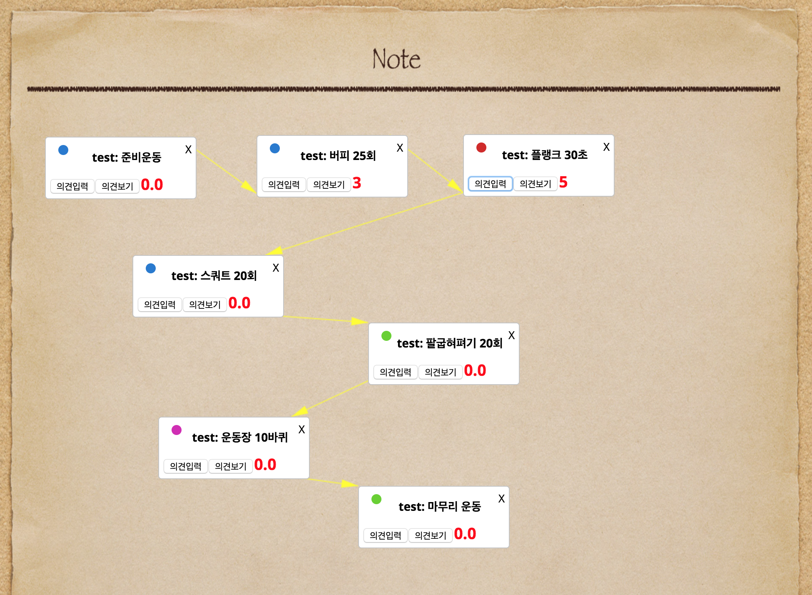
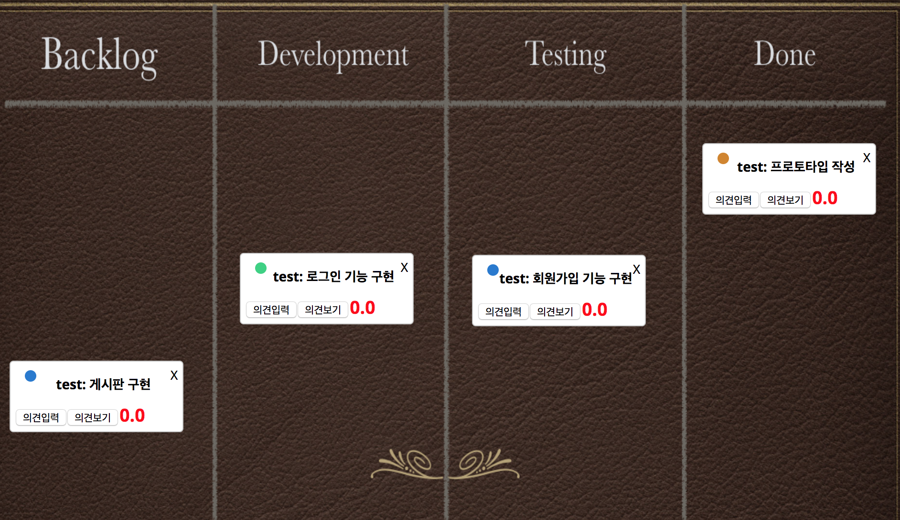

# Braim
CNU Mentoring Project 3 - Team06
BRAIn storMing tool

## 준비 되어야할 환경
+ Nodejs
+ MongoDB

## 시작 방법
1. 프로젝트 폴더에서 Node packege manager를 이용하여 기본 라이브러리들을 설치하여야합니다.
프로젝트 폴더로 이동한 후 터미널에 아래 명령어를 입력합니다.

    npm install

2. nodejs를 이용하여 app.js 파일을 실행시켜야 합니다.

    nodejs ./app.js

3. 포트 번호는 3001번으로 지정하였습니다.
브라우저를 켜고,

    localhost:3001

로 접속하면 Braim의 시작 화면을 볼 수 있습니다.

회원가입 후 Braim을 이용하세요.

## 기능
1. 아이디어 실시간 공유 화면
2. 화면 클릭시 아이디어 카트 생성
3. 아이디어 카드 작성 후 드래그로 움직이는 기능
4. 아이디어 카드 클릭 후 다른 카드 클릭시 화살표 연결 기능
5. 아이디어 카드 댓글 달고 5점 만점 평가 기능
6. 테마 변경 기능으로 브레인 스토밍 
7. 채팅 기능

## 화면

  

